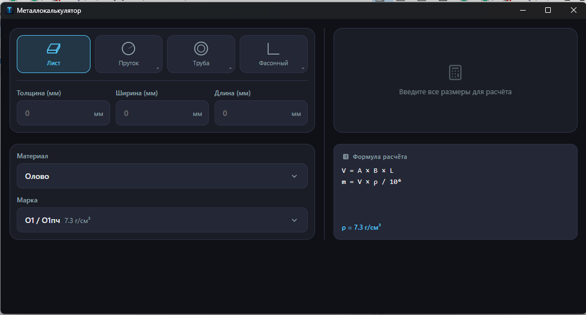
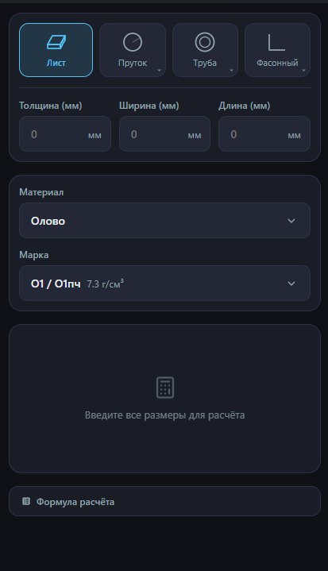

# ⚖️ Металлокалькулятор (MetalCalc)

> Быстрый, легковесный и точный кроссплатформенный калькулятор расчёта массы и длины металлопроката.

[](https://svelte.dev/)
[](https://tauri.app/)
[](https://vitejs.dev/)
[](releases/)
[](test/)
[](LICENSE)

---

## 📸 Скриншоты

| Десктопная версия (Windows / Web) | Мобильная версия (Android) |
| :---: | :---: |
|  |  |

---

## ✨ Возможности

- ⚡ **Мгновенный расчёт** — автоматический пересчёт общей массы и веса 1 погонного метра при вводе любых параметров.
- 📐 **12 типов проката** — лист, круг, квадрат, шестигранник, трубы (круглая, квадратная, прямоугольная), уголки (равнополочный и неравнополочный), швеллер, двутавр и тавр.
- 🔩 **Большая база материалов** — чёрная и нержавеющая сталь, медь, алюминий, латунь, бронза, титан, цинк, свинец и др. с точными удельными плотностями.
- 🌓 **Адаптивный дизайн и темы** — удобная работа на смартфонах и ПК, поддержка тёмной и светлой тем, автосохранение последнего выбора.
- 🪶 **Минимум веса, максимум скорости** — собран на Svelte 4 и Tauri 2, десктопный бинарник занимает всего ~2.7 МБ, а мобильный APK — ~5.7 МБ.

---

## 📋 Минимальные системные требования

### 💻 Windows
- **Операционная система**: Windows 7 SP1 / 8 / 8.1 / 10 / 11 (32-bit `x86` или 64-bit `x64`).
- **Среда выполнения**: [Microsoft Edge WebView2](https://developer.microsoft.com/en-us/microsoft-edge/webview2/) (в Windows 10/11 предустановлен; для Windows 7/8 ставится автоматически).
- **Процессор**: 1 ГГц и выше.
- **Оперативная память**: от 512 МБ (потребление памяти приложением ~30–50 МБ).
- **Свободное место на диске**: от 15 МБ.

### 📱 Android
- **Операционная система**: Android 7.0 (Nougat, API level 24) или выше.
- **Архитектура процессора**: 
  - `ARM64` (arm64-v8a) — большинство современных смартфонов и планшетов;
  - `ARMv7` (armeabi-v7a) — старые 32-битные ARM устройства;
  - `x86` — планшеты на Intel Atom и эмуляторы.
- **Компонент**: системный `Android System WebView` (обновляется через Google Play).
- **Оперативная память**: от 1 ГБ.
- **Свободное место на диске**: от 20 МБ.

### 🌐 Web-виджет (браузер)
- **Браузер**: Chrome 80+, Firefox 75+, Edge 80+, Safari 14+ или любой современный мобильный браузер.
- **Сеть**: подключение к интернету требуется только для первой загрузки; далее калькулятор работает **100% офлайн**.

---

## 📦 Готовые сборки

Файлы размещаются в папке [`releases/`](releases/):

| Платформа | Файл | Архитектура | Описание |
|---|---|---|---|
| **Windows** | `metallcalc.exe` / `metallcalc-x64.exe` | 64-bit (x64) | Портативная версия (не требует установки) |
| **Windows** | `metallcalc-setup.exe` | 64-bit (x64) | Установщик Windows (NSIS) |
| **Windows** | `metallcalc-x86.exe` | 32-bit (x86) | Портативная версия для 32-битной Windows |
| **Windows** | `metallcalc-x86-setup.exe` | 32-bit (x86) | Установщик для 32-битной Windows (NSIS) |
| **Android** | `metallcalc-arm64-release.apk` | ARM64 (arm64-v8a) | Подписанный APK для современных устройств |
| **Android** | `metallcalc-armv7-release.apk` | ARMv7 (32-bit ARM) | Подписанный APK для старых смартфонов |
| **Android** | `metallcalc-x86-release.apk` | x86 (32-bit Intel) | Подписанный APK для x86-устройств/эмуляторов |
| **Web** | `metallcalc-web.zip` | HTML / CSS / JS | Готовый архив статики для любого веб-сервера / CMS |

---

## 🚀 Разработка и сборка

### Установка зависимостей
```bash
npm install
```

### Запуск в браузере (Dev-режим)
```bash
npm run dev
```

### Тестирование (Vitest)
```bash
npm test
```

### Скрипты сборки (.bat)
- **`build-all.bat`** — **единый скрипт «всё в одном»**: запускает тесты, собирает и упаковывает веб-версию в `.zip`, компилирует Windows EXE (`x64` и `x86`) и собирает подписанные Android APK (`ARM64`, `ARMv7`, `x86`).
- **`build-exe.bat`** — сборка под Windows. Меню выбора (`x64`, `x86`, `all`) или аргумент командной строки:
  ```cmd
  build-exe.bat x64   :: Собрать 64-битную версию
  build-exe.bat x86   :: Собрать 32-битную версию
  build-exe.bat all   :: Собрать обе версии (x64 + x86)
  ```
- **`build-apk.bat`** — сборка Android APK. Меню выбора (`arm64`, `armv7`, `x86`, `all`) или аргумент командной строки:
  ```cmd
  build-apk.bat arm64 :: Собрать ARM64 APK
  build-apk.bat armv7 :: Собрать 32-битный ARM APK (ARMv7)
  build-apk.bat x86   :: Собрать x86 APK
  build-apk.bat all   :: Собрать APK под все архитектуры
  ```

Подробные команды и нюансы сборки описаны в [CHEATSHEET.md](CHEATSHEET.md).

---

## 🌐 Встраивание на сайт

Калькулятор можно легко встроить в любую веб-страницу или CMS:
```bash
npm run build
```
Подключите результат сборки из `dist/`:
```html
<link rel="stylesheet" href="assets/index.css">
<div id="app"></div>
<script type="module" src="assets/index.js"></script>
```
